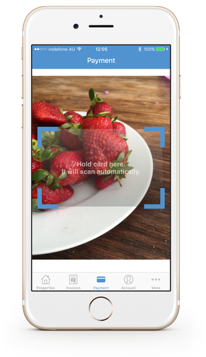

# card.io component for React Native

A fully featured implementation of [card.io](https://www.card.io/) for iOS and Android.



## Installation iOS

1. Run `npm install react-native-card-io --save` in your project directory
1. Inside `node_modules`, unzip `react-native-card-io/ios/libs/card.io-iOS-SDK/CardIO/libCardIO.a.zip`
1. Open your project in XCode, right click on `Libraries` and click `Add Files to "Your Project Name"`
1. Within `node_modules`, find `react-native-card-io/ios` and add RCTCardIO.xcodeproj to your project.
1. Add `libRTCCardIO.a` to `Build Phases -> Link Binary With Libraries`
1. Add the `-lc++` flag to `Build Settings -> Other Linker Flags`

## Installation Android

TODO: Currently building a react-native app for iOS and Android, so this will be done soon :)

## Usage

``` javascript
let CardIO = require('react-native-card-io');
let { CardIOUtilities, CardIOView } = CardIO;

...

componentDidMount() {
  // The preload method prepares card.io to launch faster. Calling preload is optional but suggested.
  // On an iPhone 5S, for example, preloading makes card.io launch ~400ms faster.
  // The best time to call preload is when displaying a view from which card.io might be launched;
  // e.g., inside your view controller's componentDidMount method.
  // preload works in the background; the call to preload returns immediately.
  CardIOUtilities.preload();
},

render() {
  if (CardIOUtilities.canReadCardWithCamera) {
    return (
      <View>
        <CardIOView
          languageOrLocale="en_AU"
          guideColor="red"
          useCardIOLogo={true}
          hideCardIOLogo={false}
          allowFreelyRotatingCardGuide={true}
          scanInstructions={''}
          scanOverlayView={<View />}
          scanExpiry={true}
          scannedImageDuration={2}
          detectionMode={CardIOView.cardImageAndNumber}
          didScanCard={result => console.log(result)} />      
      </View>
    );
  }
  return (
    <View style={styles.noCamera}>
      <Text>card.io requires a camera</Text>
    </View>
  );
}

```

## CardIOView

### props

See `card_io_view.js` for all `React.PropTypes`.
All props are optional and the view can be used with simply:

``` javascript
<CardIOView style={{flex: 1}} />
```

### didScanCard

The `didScanCard` function returns the following object:

``` Javascript
{
  cardNumber: string,
  redactedCardNumber: string,
  expiryMonth: number, // January == 1
  expiryYear: number,
  cvv: string,
  postalCode: string,
  scanned: boolean,
  cardImage: string, // base64
  cardType: string,
  logoForCardType: string, // base64
}
```

To display the images returned by `didScanCard` use the following:

``` javascript
<Image source={{uri: 'data:image/png;base64,'+ cardImage, isStatic: true}} />
```

## TODO

- [ ] Android implementation
- [ ] implement `CardIOPaymentViewController`
- [ ] add rotation notifications

## Secure

card.io does not store or transmit credit card numbers.